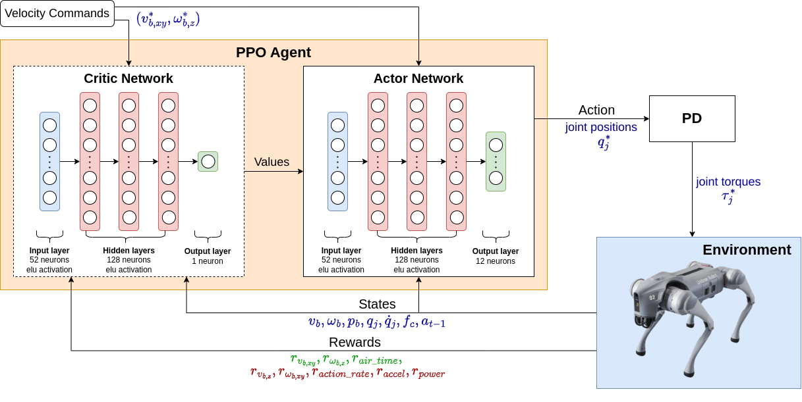

# IsaacOrbit-Quadruped-RL

This repository offers environments for training quadruped robots using Reinforcement Learning in Isaac Orbit. The training framework is presented in the image below.



## Installation
1. Begin by installing NVIDIA's [Isaac Sim](https://docs.omniverse.nvidia.com/isaacsim/latest/index.html) and [Isaac Orbit](https://isaac-sim.github.io/IsaacLab/) v0.2.
2. This repository includes two Isaac Orbit extensions. To install them, follow these steps:
   ```bash
   $ git clone git@github.com:felipemohr/IsaacOrbit-Quadruped-RL.git
   $ cd IsaacOrbit-Quadruped-RL
   $ conda activate orbit
   $ . install_extensions.sh
   ```

## Training Unitree Go2 robot
- Utilize the `train.py` script from Isaac Orbit (`orbit/source/standalone/workflows/rsl_rl/train.py`) for training the robot.
- Within the `train.py` script, import the `orbit_quadruped_rl` package to access the necessary task:
  ```python
  import omni.isaac.contrib_tasks  # noqa: F401
  import omni.isaac.orbit_tasks  # noqa: F401
  import omni.isaac.orbit_quadruped_rl # Add this import
  ```
- To initiate training, execute `train.py`, specifying the task (`Isaac-Quadruped-Go2-v0`) and the desired number of parallel environments. The `headless` flag can be used to speed up training significantly:
  ```bash
  $ cd $YOUR_ORBIT_WORKSPACE$
  $ conda activate orbit
  $ python orbit/source/standalone/workflows/rsl_rl/train.py --task Isaac-Quadruped-Go2-v0 --num_envs 2048 --headless
  ```
- Training logs will be generated in the directory where the training script was executed. Visualize these logs using TensorBoard:
  ```bash
  $ python -m tensorboard.main --logdir=$PATH_TO_YOUR_LOGS_DIR$
  ```

## Playing the trained agent
- Access a pre-trained model located in `IsaacOrbit-Quadruped-RL/logs/rsl_rl/quadruped_go2/env_v2/env_20k/`.
- Use the `play.py` script from Isaac Orbit (`orbit/source/standalone/workflows/rsl_rl/play.py`) to test the trained agent. Ensure to modify the script as follows:
  ```python
  parser.add_argument("--my_checkpoint", type=str, default=None, help="Path to model checkpoint.") # Add this new argument
  ```
  ```python
  import omni.isaac.contrib_tasks  # noqa: F401
  import omni.isaac.orbit_tasks  # noqa: F401
  import omni.isaac.orbit_quadruped_rl # Add this import
  from omni.isaac.orbit_tasks.utils import get_checkpoint_path, parse_env_cfg
  from omni.isaac.orbit_tasks.utils.wrappers.rsl_rl import (
      RslRlOnPolicyRunnerCfg,
      RslRlVecEnvWrapper,
      export_policy_as_onnx,
  )
  ```
  ```python
  # resume_path = get_checkpoint_path(log_root_path, agent_cfg.load_run, agent_cfg.load_checkpoint)
  resume_path = args_cli.my_checkpoint # Add this line and comment the above
  ```
- Execute the script:
  ```bash
  $ cd $YOUR_ORBIT_WORKSPACE$
  $ conda activate orbit
  $ python orbit/source/standalone/workflows/rsl_rl/play.py --task Isaac-Quadruped-Go2-v0 --my_checkpoint IsaacOrbit-Quadruped-RL/logs/rsl_rl/quadruped_go2/env_v2/env_20k/model_19999.pt
  ```

https://github.com/felipemohr/IsaacOrbit-Quadruped-RL/assets/50018670/72cf6558-4fb4-4fa7-babf-4154c043ec0e


